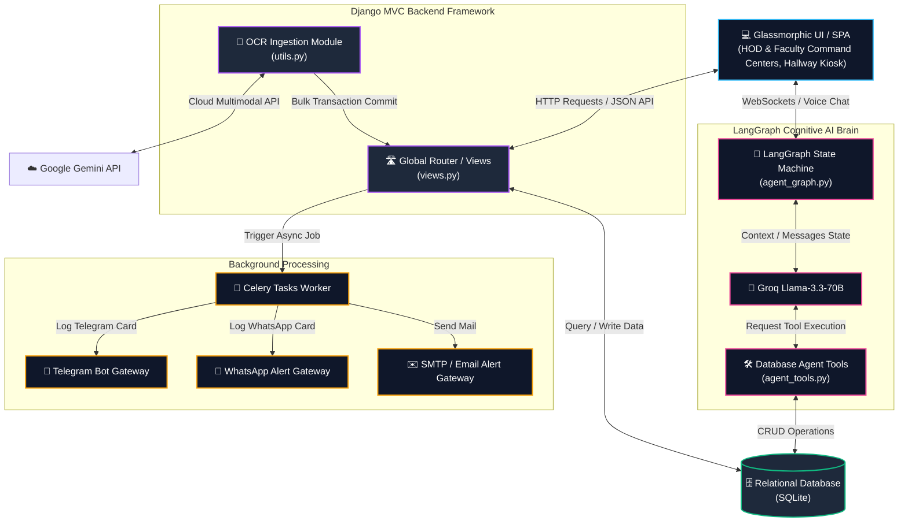
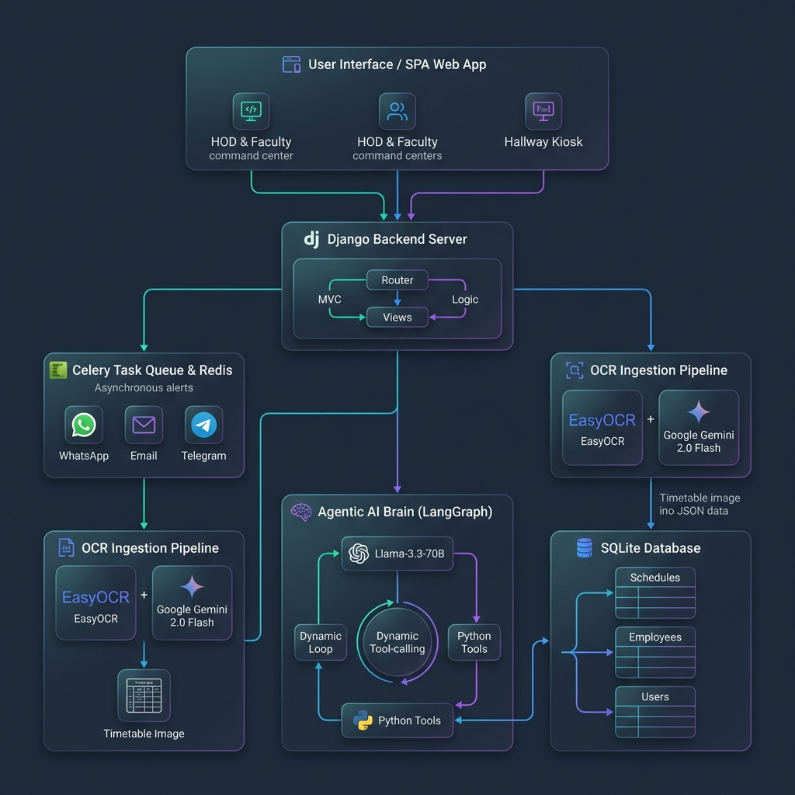
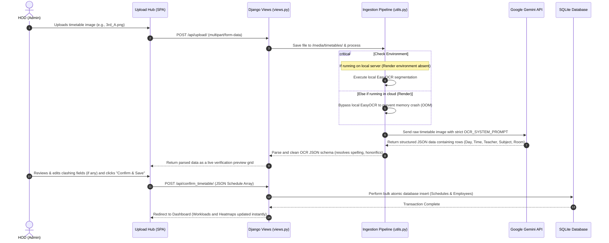

# ChronosAI — Intelligent Timetable & Agentic Proxy Management System

A production-grade Django web application for digitizing college timetables via OCR,
managing faculty schedules, and assigning proxy teachers using an AI agent.

---

## Architecture & System Flow

### 1. High-Level Component Architecture
This block diagram shows how the Single Page Application, Django Backend, SQLite Database, Celery background worker, and LangGraph cognitive brain interact.



### 2. Visual Architecture Flowchart
Here is a premium graphical representation of the ChronosAI System Architecture:



### 3. OCR Ingestion Pipeline Flow
When an HOD uploads a printed timetable image, this pipeline automatically digitizes it and maps it directly to database rows.



### 4. Agentic AI & LangGraph Decision Loop
This flow details how the cognitive AI assistant resolves queries (like proxy allocations or scheduling checks) in a transaction-safe manner.

```mermaid
sequenceDiagram
    autonumber
    actor User as User (HOD or Faculty)
    participant Chat as AI Assistant UI
    participant Graph as LangGraph State (agent_graph.py)
    participant LLM as Groq Llama-3.3-70B
    participant Tools as DB Agent Tools (agent_tools.py)
    participant DB as SQLite Database

    User->>Chat: Asks: "Meha Ma'am's Monday 09:35 proxy assign crow to Arihant Sir"
    Chat->>Graph: POST /api/chat/ with message list & current date/day context
    Graph->>LLM: Pass conversation history + active system prompt context
    Note over LLM: LLM identifies intent to assign a proxy.<br>Binds schema parameters.
    LLM-->>Graph: Requests tool call: assign_proxy_tool(day="Monday", time="09:35", absent_teacher="Prof. Meha", proxy_teacher="Prof. Arihant")
    Graph->>Tools: Execute assign_proxy_tool with arguments
    
    rect rgb(30, 41, 59)
        Note over Tools: Double-Booking Conflict Guard checks:
        Tools->>DB: Query: Is Arihant already scheduled at 09:35 on Monday?
        DB-->>Tools: Answer: No, he is free.
        Tools->>DB: Update Schedule row for Meha: is_proxy=True, proxy_teacher_name="Prof. Arihant"
        DB-->>Tools: Row updated successfully
    end
    
    Tools-->>Graph: Return execution result: "Proxy assigned successfully."
    Graph->>LLM: Pass execution result back into conversation state
    LLM-->>Graph: Formulate final user-facing response card
    Graph-->>Chat: HTTP Response: "I have successfully assigned Prof. Arihant as a proxy..."
    Chat->>User: Display response and update the timeline grid in real-time
```



### 5. Mutual Lecture Swap Request & Approval Flow
How two faculty members exchange scheduling slots with HOD authorization and automated notification alerts.

```mermaid
sequenceDiagram
    autonumber
    actor F1 as Requesting Faculty (e.g., Meha)
    actor F2 as Target Faculty (e.g., Arihant)
    actor HOD as HOD (Approver)
    participant Views as Django Views (views.py)
    participant DB as SQLite Database
    participant Celery as Celery Tasks (tasks.py)

    F1->>Views: Submit Swap Request (Slot A ↔ Slot B)
    Views->>DB: Create SwapRequest record with status='Pending'
    DB-->>Views: Saved
    Views-->>F1: Swap Request logged in database
    
    Note over HOD: HOD logs in and checks "Swap Request Approvals Queue"
    HOD->>Views: Clicks "Approve" (POST /api/swap-request/action/)
    
    rect rgb(30, 50, 40)
        Note over Views: Django Database atomic transaction
        Views->>DB: Validate double booking clashing limits
        Views->>DB: Swap Employee ForeignKeys between the 2 Schedule entries
        Views->>DB: Update SwapRequest status to 'Approved'
    end
    
    DB-->>Views: Commit Transaction
    Views->>Celery: Trigger async background notifications
    Views-->>HOD: Dashboard refreshed
    
    par Async Alerts
        Celery->>F1: Send Email + Simulated WhatsApp message confirmation
        Celery->>F2: Send Email + Simulated Telegram notification confirmation
    end
```



---

## Prerequisites

- Python 3.10+
- Redis (for Celery message broker)
- A Groq Cloud API key (free at https://console.groq.com)

---

## Quick Start

### 1. Clone and set up virtual environment

```bash
cd chronosai
python -m venv venv

# Windows
venv\Scripts\activate

# macOS / Linux
source venv/bin/activate
```

### 2. Install dependencies

```bash
pip install -r requirements.txt
```

> **Note on EasyOCR**: First run downloads ~100MB of model weights. If you skip EasyOCR
> installation, the system automatically uses realistic mock data for demos.

### 3. Set your Groq API key

```bash
# Windows (PowerShell)
$env:GROQ_API_KEY = "gsk_your_key_here"

# macOS / Linux
export GROQ_API_KEY="gsk_your_key_here"
```

### 4. Run database migrations

```bash
python manage.py makemigrations
python manage.py migrate
```

### 5. Start Redis (required for Celery)

```bash
# Using Docker (easiest)
docker run -d -p 6379:6379 redis:alpine

# Or install Redis natively and run:
redis-server
```

### 6. Start the Celery worker (separate terminal)

```bash
# Windows (--pool=solo for stability)
celery -A core worker --loglevel=info --pool=solo

# macOS / Linux
celery -A core worker --loglevel=info
```

### 7. Start the Django development server

```bash
python manage.py runserver
```

### 8. Open the app

Navigate to: **http://127.0.0.1:8000**

---

## How to Use

### Phase 1 — Upload & Digitize
1. Drag and drop a college timetable image (PNG/JPG) into the left panel upload zone.
2. The system runs EasyOCR to extract text, then sends it to Groq's `llama-3.3-70b-versatile`.
3. A structured editable table appears with all extracted schedule entries.

### Phase 2 — Verify & Save
1. Review the extracted data in the table. Click any cell to edit it.
2. Add missing rows with the "+ Add Row" button.
3. Click **"Confirm & Save to Database"** to bulk-save everything.

### Phase 3 — Chat with ChronosAI
Use the chat panel on the right to query schedules and assign proxies:

| Query Example | Action |
|--------------|--------|
| `Show me the Thursday schedule` | Fast-path ORM query (< 2s) |
| `What can you do?` | Bot capability description |
| `Who is free Monday at 10:00?` | LangGraph → find_free_faculties_tool |
| `Dr. Sharma is absent Friday at 9 AM, assign a proxy` | LangGraph → find + assign tools |
| `What does Prof. Kumar teach on Wednesday?` | LangGraph → get_faculty_schedule_tool |

### Phase 4 — Async Alerts
When a proxy is assigned (via chat or API), a Celery task is triggered.
Watch the **Celery worker terminal** for the formatted email notification log.

---

## API Endpoints

| Method | URL | Description |
|--------|-----|-------------|
| `GET` | `/` | Main dashboard |
| `POST` | `/api/upload/` | Upload timetable image |
| `POST` | `/api/confirm/` | Save verified schedule to DB |
| `POST` | `/api/chat/` | Chat with ChronosAI agent |
| `POST` | `/api/proxy/` | Direct proxy assignment |

---

## Directory Structure

```
chronosai/
├── core/
│   ├── __init__.py          # Celery app loader
│   ├── celery.py            # Celery configuration
│   ├── settings.py          # Django settings
│   ├── urls.py              # Root URL config
│   └── wsgi.py
├── scheduler_api/
│   ├── templates/
│   │   └── index.html       # Full dashboard UI
│   ├── __init__.py
│   ├── admin.py             # Admin registrations
│   ├── agent_graph.py       # LangGraph StateGraph
│   ├── agent_tools.py       # 4 LangChain @tool functions
│   ├── models.py            # Employee, Schedule, TimetableFile
│   ├── tasks.py             # Celery proxy alert task
│   ├── urls.py              # App URL patterns
│   ├── utils.py             # EasyOCR + Groq pipeline
│   └── views.py             # All Django views
├── media/                   # Uploaded timetable images
├── manage.py
└── requirements.txt
```

---

## Configuration

Edit `core/settings.py` to change:
- `GROQ_API_KEY` — your Groq Cloud API key
- `CELERY_BROKER_URL` — Redis connection string
- `DATABASES` — switch to PostgreSQL for production

---

## Running Without Redis/Groq

The system has graceful fallbacks:
- **No GROQ_API_KEY**: Uses realistic mock schedule data (20 entries across 5 days)
- **No Redis**: Remove Celery task calls; proxies still save to DB
- **No EasyOCR**: Falls back to mock OCR text

This ensures full demo capability even without external services.

---

## Fail-Safe Router Logic

The `ChatAssistantView` implements a two-tier routing strategy:

1. **Fast Path (< 2s guaranteed)**: Intercepts queries containing day keywords
   (`monday`, `tuesday`, etc.) combined with schedule intent words, OR bot
   description queries (`what can you do`). Served directly from Django ORM.

2. **Agent Path**: All other queries route through the full LangGraph circuit
   with `llama-3.1-8b-instant`, which selects and executes the appropriate tool.

This prevents rate-limit lockouts and ensures reliable demo performance.
